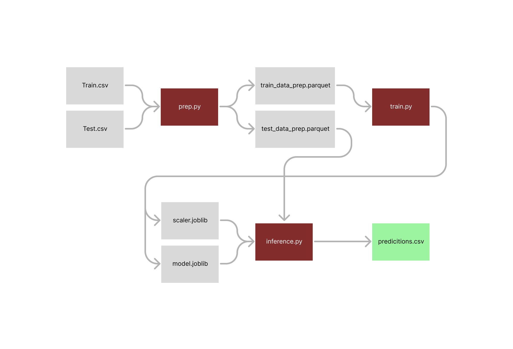

# House Price Prediction
### Arquitectura de Productos de Datos 2024
### ITAM

### Descripción 
Este proyecto utiliza datos históricos de precios de casas para predecir el precio de una casa dadas ciertas características. El proyecto está estructurado en tres partes principales: preparación de datos, entrenamiento del modelo y inferencia.

### Estructura del Proyecto 
El repositorio está organizado en las siguientes carpetas y archivos:

```
├── LICENSE
├── README.md
├── data
│   ├── data_description.txt
│   ├── test.csv
│   └── train.csv
├── inference.py
├── logs
├── notebooks
│   ├── tarea_1.ipynb
│   └── tarea_1_2.ipynb
├── prep.py
├── src
│   └── utils.py
└── train.py
```

#### Flujo


### Configuración 
#### Requisitos 
Antes de comenzar, asegúrate de tener Python instalado en tu sistema y correr en un ambiente virtual
```bash
pip install -r requirements.txt
```

#### Preparación de Datos 
Para preparar los datos para el entrenamiento y la inferencia, ejecuta el siguiente comando: 

```bash
python prep.py 
```

#### Entrenamiento del Modelo 
Para entrenar el modelo con los datos preparados, ejecuta: 
```bash
python train.py 
```
Esto generará un modelo entrenado y lo guardará como model.joblib en la carpeta data del proyecto.
* Este script acepta parámetros en caso de querer ajustar manualmente n_estimators, random_seed y max_depth para el modelo Random Forest

#### Inferencia
Para realizar predicciones con un conjunto de datos de inferencia utilizando el modelo entrenado, ejecuta: 
```bash
python inference.py
```
Las predicciones se guardarán en data.

#### pytest
pytest<br>
======================================================================= test session starts =======================================================================<br>
platform darwin -- Python 3.9.7, pytest-8.0.2, pluggy-1.4.0<br>
rootdir: /Users/reye011/Library/CloudStorage/OneDrive-SonyMusicEntertainment/Documents/ITAM/métodos_de_gran_escala/house_prices_model_implementation<br>
collected 2 items                                                                                                                                                 <br>
<br>
test_utils.py ..                                                                                                                                            [100%]<br>
<br>
======================================================================== 2 passed in 3.04s ========================================================================<br>


